A full RetroAchievements tracking and management system inside the Quick Access Menu. Track achievements, build custom lists, keep notes, reminders and goals, read guides, even follow activity feeds, discussions and community events — all without leaving your game.

## Features

CheevoDeck isn't just a basic RetroAchievements tracker — it's a full suite for achievement hunters who want an enjoyable, cozy, and smooth time obtaining their goals. It was built from the ground up to take advantage of the Steam Quick Access Menu, offering a smooth, portable experience.

- **Advanced tracking** — Tracking an achievement adds it to a special per-game list built to keep you organized: categorize them, add notes, view info, and more. Unlock it and it quietly takes itself off the list.

- **Comment tracking** — Stuck on a tough achievement? Subscribe to an achievement or a game's comments and you'll know the moment somebody replies, whether the panel is open or you're deep in a game. Find advice worth hanging onto and you can favorite it, and it'll be sitting in the Social Hub whenever you come back for it.

- **Notes, goals and reminders** — Create per-game notes/goals/reminders in style! Color them, tag them into categories, set a reminder once or on repeat. Mark one complete and it gets filed away under Completed, or just delete it instead.

- **GameFAQs integration** — Pick a guide for whatever you're playing and open it without ever leaving the game. Access guides quickly by enabling the special guides pin that appears on each page at the top or map it to a button on your controller. It's not just a boring guides viewer. It has zoom, search, bookmarks, and supports both formatted and classic guides. You can view guides from the quick access menu for portability or you can view them in a large dialog for wider view.

- **Social** — Unlike traditional tracker apps, CheevoDeck offers rich social features, such as friend activity feeds, in-app comments viewing/tracking, wall post notifications, live notifications, and more. Don't have any friends? Don't sweat it! CheevoDeck offers a unique social feature called, **Players Near You**, which is a special per-game social feed that show players around your progress. It's a good opportunity to reach out and connect with those around you, and CheevoDeck makes that incredibly easy! You are able to view others' profiles in the **Profile Page**, where you can post comments, follow new friends, and offers many things to view: all game, recent game, game progress, want to play, awards, wall posts, stats, and much more. Because the RA API, does not offer the ability befriend someone or post comments, CheevoDeck makes this as seamless as possible being sent to directly where you need to be. For example, each in-app comments section has a **Post** button where you will be sent directly to the comments section externally where you can post a comment. Finally, if you have a competitive itch, there are multiple ways to do so, such as comparing stats & achievements, viewing a ranking amongst friends, and comparing stats in leaderboards—offering filters to filter just between you and friends or against everyone.

- **Community features** — The best part of RetroAchievements is the people. Join in with Achievement of the Week, catch the latest RA news to participate in special events, and watch new sets and revisions as they land.

- **Multiple accounts** — Sharing a device? Add another account with its own API key and switch between them, progress kept separate. Add its RA password too and switching signs you into most of your emulators for you. The password is never stored: it's traded for a token instead, and CheevoDeck even clears out any password your emulator config was hanging onto.

- **Customization** — Presets if you want it set up in a minute, and over 200 options if you'd rather take your time. Map controls to actions and shortcuts, scale the UI, tune every notification, choose what shows up in your quick menu, and plenty more.

- **Built for the panel** — Almost everything happens in the side panel, the **Quick Access Menu**, next to your game rather than on top of it. Pause, opening the panel, check what you're missing, read a guide, reply to a friend, and drop right back in. Only a handful of things ask for the bigger dialog, and those are the ones that you genuinely may want the room for—such as notes editing dialogs or the larger version of our guides viewer.

- **Bonus utilities** —
    - **Dolphin Mapper** Sets GameCube and Wii controller layouts for Dolphin so you don't have to do it by hand. No more nightmare tuning profiles for the many different wii control schemes. This does not touch your profiles; it only changes the active controller settings.
    - **Cheevo Check** scans your ROM library and tells you which files are RetroAchievements compatible. Also, offers validating your roms to ensure they are proper dumps.
    - **File Watcher** Ideal for archivists; it keeps an eye on your ROM folders, hashes them and keeps an eye on them on a schedule you set or via manually to check file integrity. In other words, it lets you know if any of your files became corrupt due to failing controller, drive, etc. It's also smart enough to know if a file was changed, removed, etc.
    - **SMB Shares** mounts your network drives, so a library living on a NAS works the same as one on the SD card. Useful if you want to access roms/files on your network.

## Screenshots

<table>
  <tr>
    <td></td>
    <td></td>
    <td><a href="docs/images/03_tracked.webp">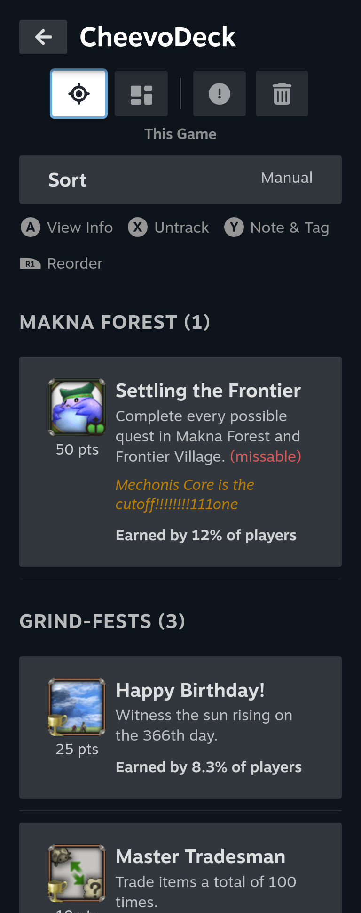</a></td>
  </tr>
  <tr>
    <td><a href="docs/images/04_notes.webp">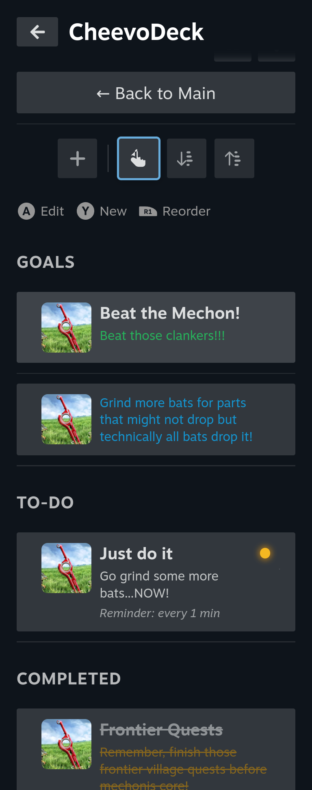</a></td>
    <td></td>
    <td><a href="docs/images/06_user_profile.webp">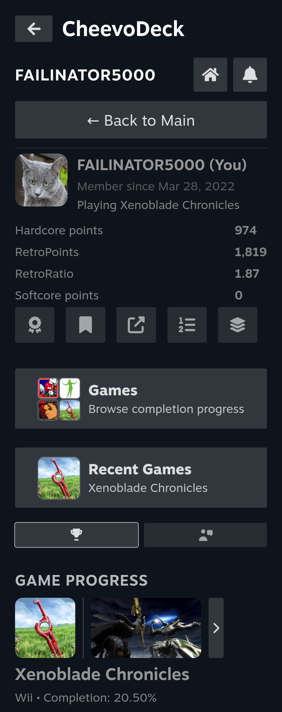</a></td>
  </tr>
  <tr>
    <td><a href="docs/images/07_players_near_you.webp">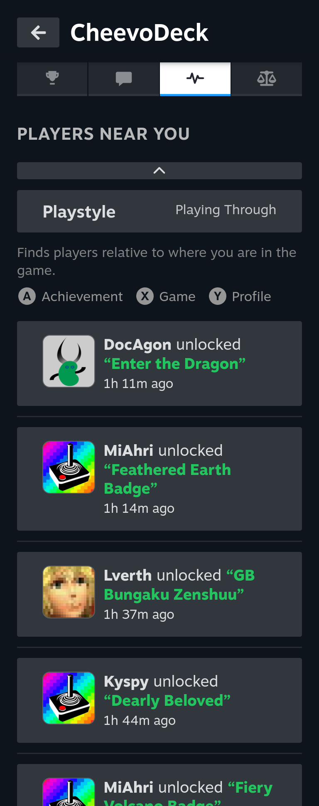</a></td>
    <td><a href="docs/images/08_social_hub_activity.webp">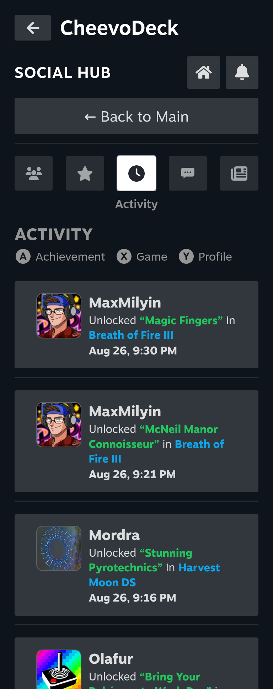</a></td>
    <td><a href="docs/images/09_community_subscribed.webp">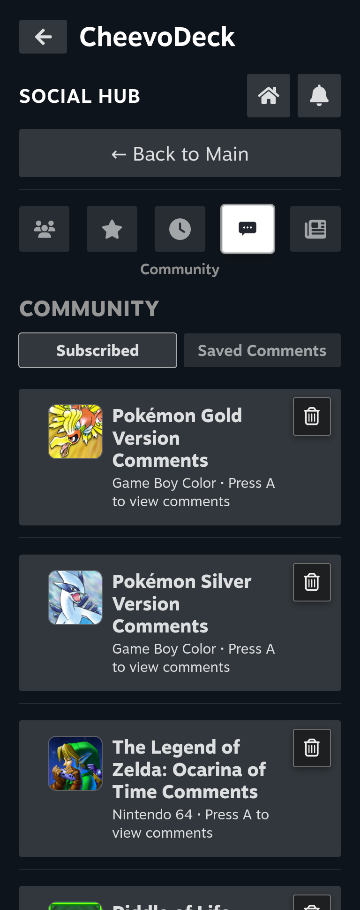</a></td>
  </tr>
  <tr>
    <td></td>
    <td><a href="docs/images/11_mastery_goals_list.webp">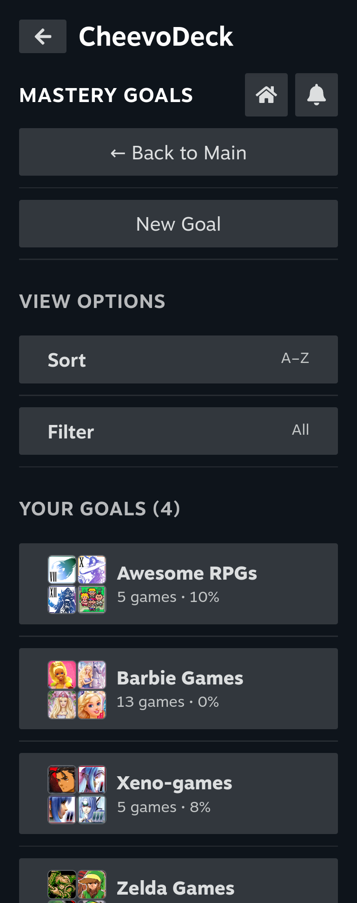</a></td>
    <td><a href="docs/images/12_mastery_goals_manage.webp">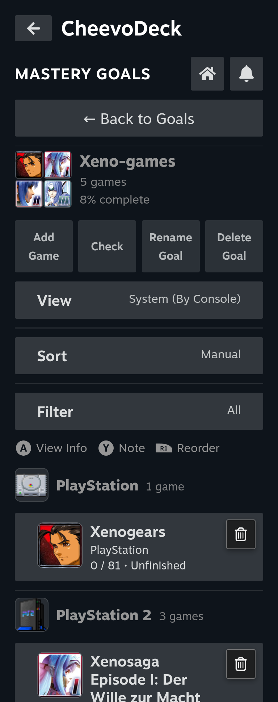</a></td>
  </tr>
  <tr>
    <td><a href="docs/images/13_guides_reader_panel.webp">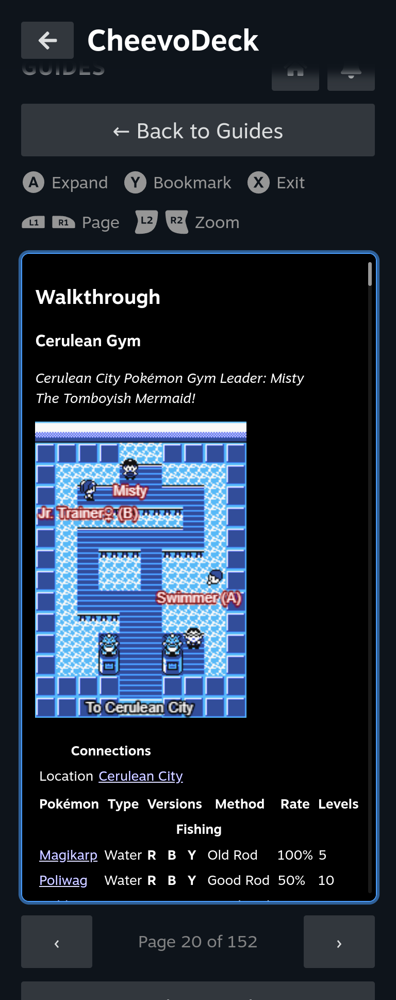</a></td>
    <td><a href="docs/images/14_friend_games.webp">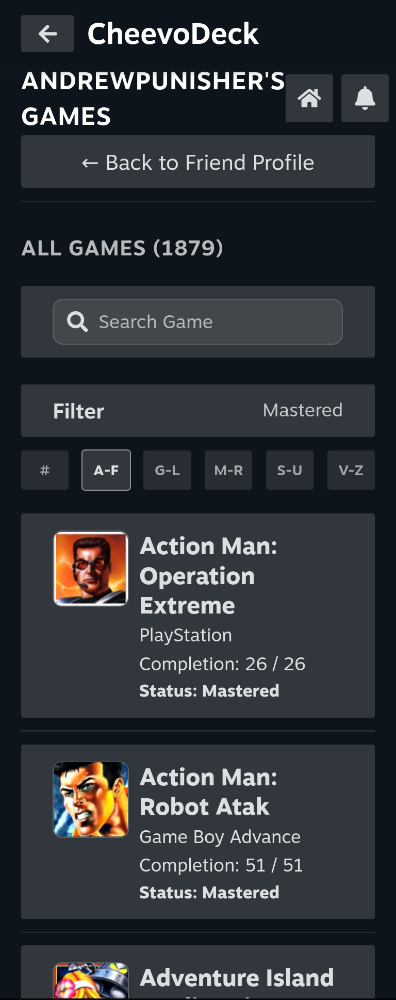</a></td>
    <td></td>
  </tr>
</table>

Here is just a sample of some of the pages within the plugin. There's plenty more!

<table>
  <tr>
    <td></td>
    <td><a href="docs/images/notifications_modal.webp">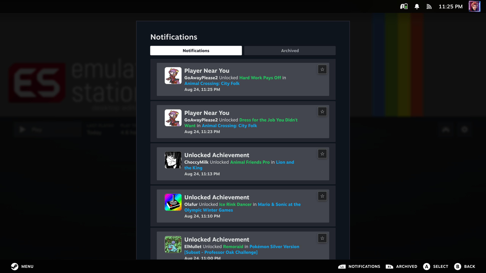</a></td>
  </tr>
</table>

These are some of the larger modal dialogs within CheevoDeck: Large Guide Viewer and Notifications—both of which can be accessed from any page.

## Requirements

- Any device with **SteamOS** is required to run the plugin (Steam Deck, Steam Machine, Asus ROG Ally, custom installation, etc.)
- **Decky Loader** is also required to be installed on your SteamOS device.
- A **RetroAchievements** account is required for the plugin to work.

[Get Decky Loader Here](https://github.com/SteamDeckHomebrew/decky-loader)

[Create your RetroAchievements Account Here](https://retroachievements.org/createaccount.php)

## Installation

1. Enter **Desktop Mode** and download the latest version of CheevoDeck from the [Releases page](https://github.com/FAILINATOR5000/decky-cheevodeck/releases). Place the ZIP file in an easy to access location such as desktop or downloads.
2. Go into **Game Mode** and open the **Quick Access Menu** (The ... button on Steam Deck or Steam Controller).
3. Select the **Decky Loader** plugin button (the one with the plug icon), and select the options button in the upper right corner (the gear icon).
4. Under the **General** tab, toggle **Enable Developer Mode** on. The **Developer** tab should now appear.
5. From the **Developer** section, select **Install plugin from ZIP**.
6. Select the downloaded ZIP file you had downloaded in the first step.
7. Congratulations! CheevoDeck is now installed!

## Getting Started

*Coming soon.*

## Tutorial

*Coming soon.*

## Troubleshooting

### The **Main Achievements Page** says "No Game Found"

This means that your RetroAchievements account is brand new and you have no last game registered with it yet. Simply play a supported game with that emulator signed in to your RetroAchievements account, and then go back into the CheevoDeck plugin. The data should then be loaded and populated.

### I keep getting an error saying that I have an invalid API Key all of a sudden

This can occur if you have changed your API key for RetroAchievements. To solve this, from the **Main Achievements Page** go to **Quick Menu (The hamburger-looking menu at the top) > Options > Edit Credentials**. You can click the link in the dialog that pops up to be forwarded to the dashboard on RetroAchievements. Select the **Applications** tab and then select your API Key to copy to clipboard. From here, you can go back to the **Edit Credentials** dialog to paste your new API Key. Steam's on-screen keyboard contains the **Paste** option in the lower right corner. Ensure your username is up-to-date as well, and then simply save the new details.

### I changed my username at RetroAchievements. What do I do?

CheevoDeck is pretty resilient and will continue working, as most operations use users' ULID for data persistence and access under a given account. The backend service will eventually determine you have changed your username and will self-heal, so basically you don't have to worry about it!

### I'm getting random generic error messages, such as "Couldn't refresh your achievements right now", "Couldn't load this game's achievements.", "Couldn't load your recent unlocks right now.", and/or "Couldn't check your current game right now." What do these mean???

Depending on your location within the plugin, all of those are associated with a poor connection to RetroAchievements. It could be on your end as an intermittent drop in your internet connection or it could be on RetroAchievements's end as a server hiccup. Generally, once either of the problems resolve, you shouldn't see those errors anymore. If you want more advanced details, feel free to check the logs in **/home/deck/homebrew/logs/decky-cheevodeck**.

### My friend changed their avatar and I still see the old one

The friend avatar is cached for 48 hours, so it will be updated automatically via the backend roster service within that timeframe. If you would like to force the update immediately, an easy way to do this is to go to your friends list (or favorites) within **Social Hub** and press the Y button "Resolve" option (Triangle for PlayStation controller) while your friend is selected. This will queue immediate update which will usually take place within ten seconds.

### My friend changed their username and I still see the old name

Since almost all operations are done via the users' ULID, everything will continue to work, and the roster service will update the username within one week automatically. If you want to change it immediately, from the **Main Achievements Page** go to **Quick Menu (The hamburger-looking menu at the top) > Options > Cache & Data Tab > Refresh Friends Now.**

### My friend avatar is wrong. Why? And how do I fix it?

RetroAchievements stores everyone's picture at an address built from their username. The catch is that when someone changes their name, their picture doesn't move with it — it stays where it was. So the plugin can end up looking in the wrong place.

Usually that just means no picture, and you get their initial instead. CheevoDeck's roster service automatically heals this for most situations; however, there are super rare instances where occasionally it's stranger and isn't repaired properly: if somebody else has since taken your friend's old username, the old address now points at that person's picture, and you'll see a face that isn't theirs. To fix this, go to your friends list (or favorites) within **Social Hub** and press the Y button "Resolve" option (Triangle for PlayStation controller) while your friend is selected. Rare instances like this are handled automatically by default if your friend is favorited. So technically you could just favorite that friend to resolve them too.

The plugin doesn't ask for everyone automatically from RA because it's one request per person and a big friends list would be a lot of requests. In other words, it's extremely expensive and can involve too many requests hitting up the RA API. It wouldn't be fair to RetroAchievements if the roster service does routine checks on a 100-friend list frequently, so in respect to them, we have made it conditional. So in other words, if you see your friend's avatar is off, which is extremely rare, simply fix it permanently by pressing the "Resolve" button while over them in the friends list.

## Localization

CheevoDeck ships in eight languages: English, German, Spanish, French, Japanese, Polish, Portuguese and Russian. I only speak English and know a little bit of German and Japanese. For the most part, the other seven were translated without a native speaker, so while they should be perfectly understandable, some of it is bound to read stiffly or miss the phrase a player would actually use. If one of these is your language and something reads wrong to you, a fix is genuinely welcome — and so is a language that isn't here yet.

## Challenges & Limitations

### Almost everything lives in the Quick Access Menu

This was the whole point of CheevoDeck, but it's also the hardest thing to build against. The QAM side panel is a narrow column and it has no concept of pages or navigation the way a normal app does. There's no such thing as "going to another screen" in here. Every screen in the plugin actually exists at the same time, in the same place, and only one of them draws itself at a time. It's an unusual way to build something, but it certainly creates a favorable outcome.

### The panel gets unmounted/thrown away every time you close it

Not hidden, not paused. Steam destroys the whole thing and builds a brand new one the next time you open it, and it does the same any time a dialog opens on top of it. So the plugin has no memory of its own. Whatever page you were on, whatever guide you had open, where you'd scrolled to, which tab you were reading, all of it is gone the instant you close the panel unless it was written down somewhere first.

The part that took getting used to is that it has to be saved at the wrong end. You can't save on the way out, because by the time the panel is closing it has already been torn down and there's nothing left to do the saving. So things get written the moment they open instead: open a guide and the fact that you're reading that guide is saved right then before you've done anything with it. It feels backwards while you're writing it, but it's the only order that survives.

It also rules out a control I'd otherwise have used everywhere. Decky's UI library ships a dropdown component, the normal thing for a setting with a lot of possible values, the kind you press and a list appears. Decky's own settings use them. But opening one in the QAM opens what is basically a modal, so the whole panel goes down exactly like it does for a dialog: Steam draws the list over in a completely different window and leaves the panel behind it empty. The control that looks like the cheap, simple option turns out to be one of the most expensive things you can put in here, and that's why there isn't a single dropdown in CheevoDeck. Every multi-value setting in **Options** cycles through its values instead: press the row, get the next one. It looks like an odd choice until you know what the alternative costs.

Once that clicked, it works better than you'd expect. The one I'm happiest with is comments: you can be halfway down a thread on an achievement or game, open something on top of it, and come back to the same thread in the same place. That's a hard one because the panel really is gone in between, and it works on all five places comments show up in the plugin.

The one thing that still doesn't come back is the cursor. The plugin can put you on the right page with the right game loaded and the right tab open, because all of that is just information and information can be written down. Where the highlight was sitting is a different kind of thing. When the panel opens, Steam decides where the cursor goes before the plugin has finished drawing anything for it to land on, so it picks the first thing it can find, which is usually Decky's own back arrow at the top. Getting it to land on the achievement you were looking at instead is still on the list.

### The focus ring sometimes doesn't show up when you open the QAM

This one isn't CheevoDeck's fault, and you can prove it to yourself in about ten seconds. Launch a game, then spam the QAM button open and closed on a built-in section like **Performance Settings**. Same game, same panel, nothing to do with any plugin, and some of the time you will notice the component you had selected does not paint the selection ring at all. Other times it's fine. That's the whole problem in a nutshell: it's a coin flip. What's actually going on is that Steam only switches its gamepad focus system on if the panel has the keyboard focus at the exact instant it opens, and it only ever checks that once. With a game running, the game is holding onto focus, so whether the panel gets there in time before that single check happens is down to timing. When it misses, nothing on the panel gets a highlight, including Steam's own buttons. Your d-pad still moves the cursor around perfectly fine either way, you just can't see where it is. CheevoDeck nudges the panel when it opens so that Steam runs its check again and paints the ring like it should. Figuring that out took a while, because when something only breaks half the time it's very easy to blame the wrong thing. It took many nights of debugging and reading logs to determine what was going on, but I'm glad I now know or think I know what the situation was.

### Everything is paced around RetroAchievements' servers

RetroAchievements is a free, community-run site and their API will rate-limit you if you hammer it, which is completely fair. That means CheevoDeck can't just grab everything the moment you open it. Achievement icons, avatars, friend activity and progress all fill in progressively rather than instantly, and a few features are deliberately conditional instead of automatic (checking every single friend avatar on a 100-friend list would be 100 requests, and that's just not a polite thing to do to somebody else's servers). If something looks like it's loading slowly, that's usually this being deliberate rather than something being broken. You can raise the limits yourself in **Options** if you're on a fast connection, but the defaults are set to be a good guest in respect to the RA servers.

### SteamOS updates / Steam Client updates can and will break things

Steam updates its interface and client regularly, and it isn't built with plugins in mind, so things that worked perfectly fine one month can quietly stop working the next. Negative CSS margins used to work and don't anymore is one example. I know, it's probably not recommended practice, but at one-point (as this started as a personal project) I hardcoded negative margins for a feature and the spacing broke with an update. Fixed and avoided since that situation. Steam owns the scroll position and will sometimes throw away yours. None of this is anybody's fault, it's just the reality of building on top of a moving target, and it's why some parts of the plugin are written in a way that looks a bit odd until you know what broke.

## Building

### What you'll need

Node with **pnpm** (the repo is pinned to pnpm 9.15.9), and Python 3.11 to match the runtime Decky bundles. You'll also want **Decky Loader** installed on whatever device you're testing on, since that's what actually loads the plugin. You don't need Python locally to build, only if you want to run the backend checks.

One extra thing if you're touching the Python side: **ruff** is the linter I use for the backend and it isn't an npm package, so **pnpm install** won't bring it along. Install it with **pipx install ruff**, or skip installing anything and run it through **uvx**. Ignore this entirely if you're only working on the frontend.

### Getting set up

Clone the repo and run **pnpm install**. That's the only setup step for the frontend, and it brings the build along with the TypeScript and knip checks below.

### Building it

**pnpm run build**. Rollup bundles the whole frontend down into **dist/index.js**, which is the file that actually ships. There's also **pnpm run watch** if you'd rather have it rebuild as you save.

### Checking your work

**npx tsc --noEmit** is the one that matters most. TypeScript is set to strict here, plus noUnusedLocals and noUnusedParameters, so it's fussier than a default setup and it catches a lot before anything ever reaches a device.

**npx knip** looks for exports, files and dependencies that nothing uses. It's currently at zero findings and I'd like to keep it there, so if it starts reporting something after your change, that's worth a look rather than a shrug.

**ruff check main.py py_modules/** handles the Python side. The config lives in the repo as **ruff.toml**, so however you installed ruff you'll get the same rules I do. There should be exactly 6 findings, and all 6 are deliberate: I've looked at each one and decided to leave it. If you see 7, the new one is yours.

Please don't run **ruff format**. It would reformat the entire backend away from how the rest of it is written. The workspace settings in **.vscode/settings.json** already turn format-on-save off for Python so the Ruff extension can't do it to you by accident, which is the reason that file is tracked at all.

### There are no tests, and I want to be upfront about that

**npm test** is a stub that exits with an error. There's no unit test suite, no integration tests, nothing. The only real way to know something works is to put it on a Steam Deck and use it, which is a genuine downside if you're thinking about contributing, and it's the honest reason to be a little careful with changes that touch anything you can't see the effect of. The checks above will catch a lot, but they can't tell you that a page still behaves the way it should.

### Getting it onto a device

There are two scripts in **.vscode/scripts/**. **deploy-local.sh** copies the plugin into **/home/deck/homebrew/plugins/decky-cheevodeck** and restarts Decky, which is what you want if you're building on the Deck itself. **deploy.sh** does the same thing over SSH if you're working on another machine and pushing to a Deck on your network.

The SSH one has to be told where your Deck is. Copy **.vscode/deploy-settings.example.json** to **.vscode/deploy-settings.json** and fill in your host, your username, and a key path if you use one instead of a password. That file is gitignored, so your home network never ends up in a commit, and **deploy.sh** reads it itself, which means it works the same from a plain terminal as it does from the **Deploy** task in VS Code. It's read with python3 when it's there, and if you skip it entirely the script tells you rather than hanging on a connection to nowhere.

Worth knowing what actually gets copied: **dist/**, **main.py**, **py_modules/** and **defaults/**. The **src/** folder is deliberately excluded, because the bundle is what runs, not the TypeScript. So if you changed frontend code and nothing seems different on the device, the usual reason is that the build didn't run.

## Architecture

How the plugin is put together is written up in [docs/architecture.md](docs/architecture.md).

## Credits

The people and projects that made parts of CheevoDeck easier, faster, or possible at all are thanked in [ATTRIBUTIONS.md](ATTRIBUTIONS.md).

## Author & Support

CheevoDeck is written by Jameson (FAILINATOR5000).

Have any cool ideas you'd like to see implemented? Or just have questions, need help, or have bug reports? You can contact me via email at [FAILINATOR5000@proton.me](mailto:FAILINATOR5000@proton.me).

## License

BSD 3-Clause. The full text is in [LICENSE](LICENSE).

## Disclaimer

CheevoDeck is not affiliated with or endorsed by Steam, Valve, RetroAchievements, GameFAQs, or Decky Loader. It does not provide downloads to ROMs, BIOS, or game data.
