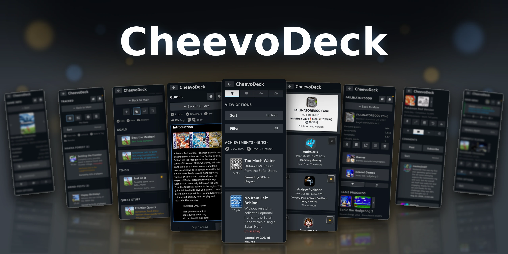

A full RetroAchievements tracking and management system inside the Quick Access Menu. Track achievements, build custom lists, keep notes, reminders and goals, read guides, even follow activity feeds, discussions and community events — all without leaving your game.

## Table of Contents

- [Features](#features)
- [Screenshots](#screenshots)
- [Requirements](#requirements)
- [Installation](#installation)
- [Getting Started](#getting-started)
- [Quick Start Tips](#quick-start-tips)
- [Updating CheevoDeck](#updating-cheevodeck)
- [Troubleshooting](#troubleshooting)
- [Localization](#localization)
- [Motivation](#motivation)
- [Challenges & Limitations](#challenges--limitations)
- [Building](#building)
- [Architecture](#architecture)
- [Credits](#credits)
- [Author & Support](#author--support)
- [License](#license)
- [Disclaimer](#disclaimer)

## Features

CheevoDeck isn't just a basic RetroAchievements tracker — it's a full suite for achievement hunters who want an enjoyable, cozy, and smooth time obtaining their goals. It was built from the ground up to take advantage of the Steam Quick Access Menu, offering a smooth, portable experience.

- **Advanced tracking** — Tracking an achievement adds it to a special per-game list built to keep you organized: categorize them, add notes, view info, and more. Unlock it and it quietly takes itself off the list.

- **Comment tracking** — Stuck on a tough achievement? Subscribe to an achievement or a game's comments and you'll know the moment somebody replies, whether the panel is open or you're deep in a game. Find advice worth hanging onto and you can favorite it, and it'll be sitting in the Social Hub whenever you come back for it.

- **Notes, goals and reminders** — Create per-game notes/goals/reminders in style! Color them, tag them into categories, set a reminder once or on repeat. Mark one complete and it gets filed away under Completed, or just delete it instead.

- **GameFAQs integration** — Pick a guide for whatever you're playing and open it without ever leaving the game. Access guides quickly by enabling the special guides pin that appears on each page at the top or map it to a button on your controller. It's not just a boring guides viewer. It has zoom, search, bookmarks, and supports both formatted and classic guides. You can view guides from the quick access menu for portability or you can view them in a large dialog for wider view.

- **Social** — Unlike traditional tracker apps, CheevoDeck offers rich social features, such as friend activity feeds, in-app comments viewing/tracking, wall post notifications, live notifications, and more. Don't have any friends? Don't sweat it! CheevoDeck offers a unique social feature called, **Players Near You**, which is a special per-game social feed that show players around your progress. It's a good opportunity to reach out and connect with those around you, and CheevoDeck makes that incredibly easy! You are able to view others' profiles in the **Profile** page, where you can post comments, follow new friends, and offers many things to view: all game, recent game, game progress, want to play, awards, wall posts, stats, and much more. Because the RA API, does not offer the ability befriend someone or post comments, CheevoDeck makes this as seamless as possible being sent to directly where you need to be. For example, each in-app comments section has a **Post** button where you will be sent directly to the comments section externally where you can post a comment. Finally, if you have a competitive itch, there are multiple ways to do so, such as comparing stats & achievements, viewing a ranking amongst friends, and comparing stats in leaderboards—offering filters to filter just between you and friends or against everyone.

- **Community features** — The best part of RetroAchievements is the people. Join in with Achievement of the Week, catch the latest RA news to participate in special events, and watch new sets and revisions as they land.

- **Multiple accounts** — Sharing a device? Add another account with its own API key and switch between them, progress kept separate. Add its RA password too and switching signs you into most of your emulators for you. The password is never stored: it's traded for a token instead, and CheevoDeck even clears out any password your emulator config was hanging onto.

- **Customization** — Presets if you want it set up in a minute, and over 200 options if you'd rather take your time. Map controls to actions and shortcuts, scale the UI, tune every notification, choose what shows up in your quick menu, and plenty more.

- **Built for the panel** — Almost everything happens in the side panel, the **Quick Access Menu**, next to your game rather than on top of it. Pause, opening the panel, check what you're missing, read a guide, reply to a friend, and drop right back in. Only a handful of things ask for the bigger dialog, and those are the ones that you genuinely may want the room for—such as notes editing dialogs or the larger version of our guides viewer.

- **Steam Machine tested** — Thoroughly tested to work well with Steam Machine, in addition to the other SteamOS devices.

- **Bonus utilities**

    - **Dolphin Mapper** — sets GameCube and Wii controller layouts for Dolphin so you don't have to do it by hand. No more nightmare tuning profiles for the many different wii control schemes. This does not touch your profiles; it only changes the active controller settings.

    - **Cheevo Check** — scans your ROM library and tells you which files are RetroAchievements compatible. Also, offers validating your roms to ensure they are proper dumps.

    - **File Watcher** — ideal for archivists; monitor the integrity of your ROMs folders by setting up a schedule to check your files against the hashes, or by running a check manually. You will be notified if your files got corrupted, changed, removed, etc., and prompted for approval of changes.

    - **SMB Shares** — mounts your network drives, so a library living on a NAS works the same as one on the SD card. Useful if you want to access roms/files on your network.

## Screenshots

<table>
  <tr>
    <td><a href="docs/images/01-main-menu.webp">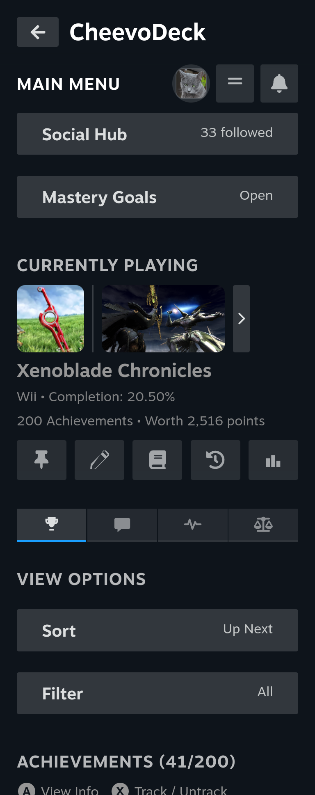</a></td>
    <td><a href="docs/images/02-main-menu-achievements.webp">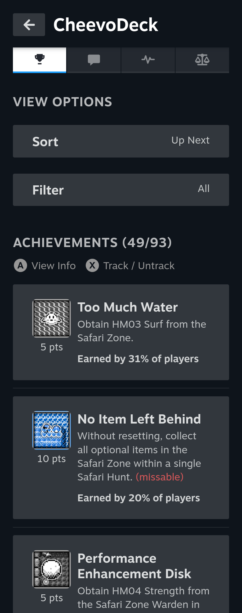</a></td>
    <td><a href="docs/images/03-tracked.webp">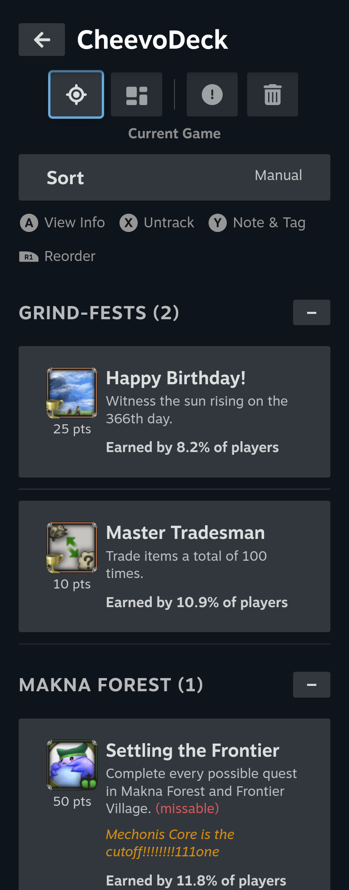</a></td>
  </tr>
  <tr>
    <td><a href="docs/images/04-notes.webp">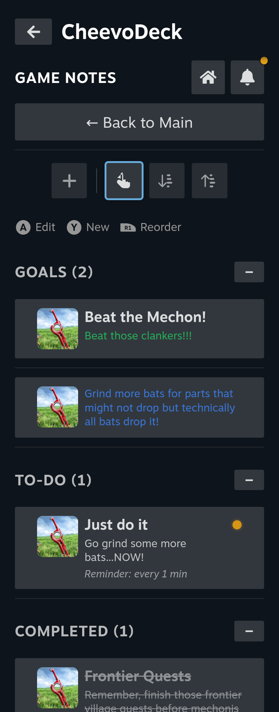</a></td>
    <td><a href="docs/images/05-friends-list.webp">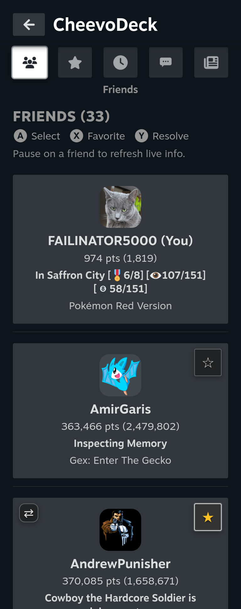</a></td>
    <td><a href="docs/images/06-user-profile.webp">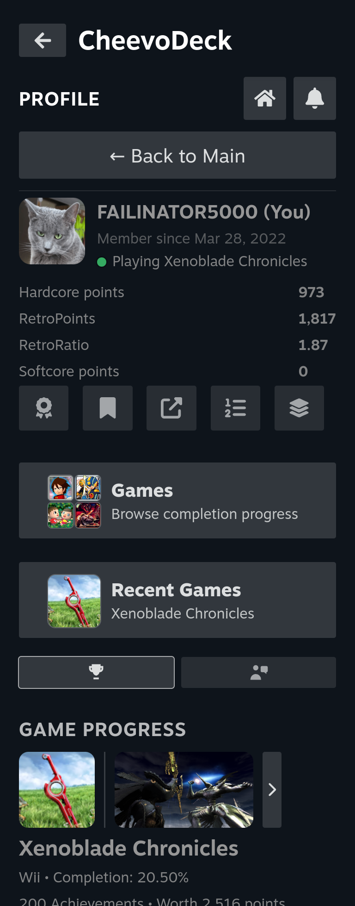</a></td>
  </tr>
  <tr>
    <td><a href="docs/images/07-players-near-you.webp">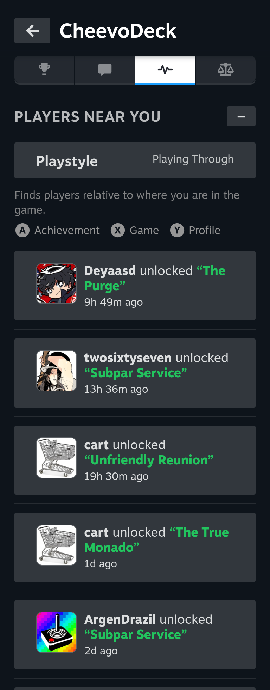</a></td>
    <td></td>
    <td></td>
  </tr>
  <tr>
    <td><a href="docs/images/10-news-and-events.webp">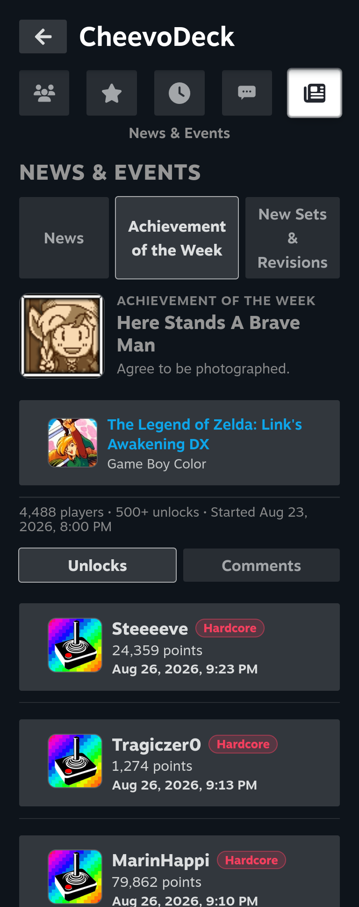</a></td>
    <td></td>
    <td></td>
  </tr>
  <tr>
    <td></td>
    <td></td>
    <td><a href="docs/images/15-main-comments.webp">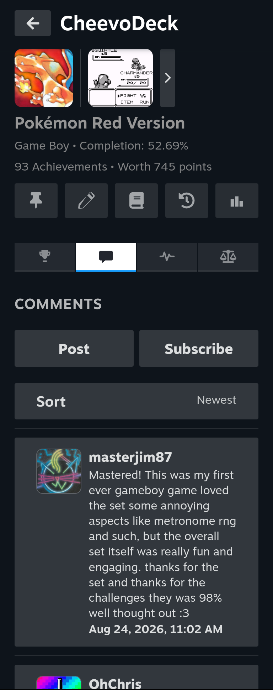</a></td>
  </tr>
</table>

Here is just a sample of some of the pages within the plugin. There's plenty more!

<table>
  <tr>
    <td><a href="docs/images/guides-reader-modal.webp">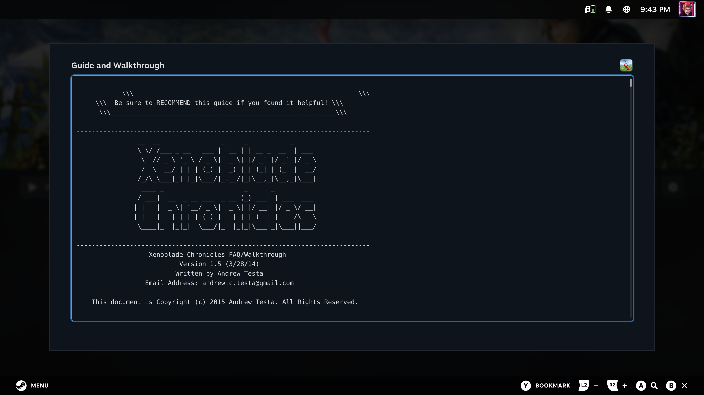</a></td>
    <td></td>
  </tr>
</table>

These are some of the larger modal dialogs within CheevoDeck: Large Guide Viewer and Notifications—both of which can be accessed from any page.

## Requirements

- Any device with **SteamOS** is required to run the plugin (Steam Deck, Steam Machine, Asus ROG Ally, custom installation, etc.)

- **Decky Loader** is also required to be installed on your SteamOS device.

- A **RetroAchievements** account is required for the plugin to work.

[Get Decky Loader Here](https://github.com/SteamDeckHomebrew/decky-loader)

[Create your RetroAchievements Account Here](https://retroachievements.org/createaccount.php)

## Installation

1. Enter **Desktop Mode** and download the latest version of CheevoDeck from the [Releases page](https://github.com/FAILINATOR5000/decky-cheevodeck/releases). Place the ZIP file in an easy to access location such as desktop or downloads.

2. Go into **Game Mode** and open the **Quick Access Menu** (The ... button on Steam Deck or Steam Controller).

3. Select the **Decky Loader** plugin button (the one with the plug icon), and select the settings button in the upper right corner (the gear icon).

4. Under the **General** tab, toggle **Enable Developer Mode** on. The **Developer** tab should now appear.

5. From the **Developer** section, select **Install Plugin from ZIP File**.

6. Select the downloaded ZIP file you had downloaded in the first step.

7. Congratulations! CheevoDeck is now installed!

## Getting Started

1. When you first start CheevoDeck, the only button you will see is the **Enter Credentials** button. Select the button to begin the setup process.

2. You will be taken to the **RetroAchievements Credentials** dialog where it will ask for your RetroAchievements account username and API key. You can find your API key at [https://retroachievements.org/settings](https://retroachievements.org/settings) under the **Applications** tab.

    The easiest way to enter it is by selecting the **Find your Web API Key on RetroAchievements** link within the **Enter Credentials** dialog itself to be taken directly to the page where you can select your API key to copy it to your clipboard. Then, simply go back to the dialog and paste your key via the **Paste** option on Steam's on-screen keyboard in the lower right. Once entered, press the **Save** button to continue the setup process.

    <a href="docs/images/getting-started-credentials.webp">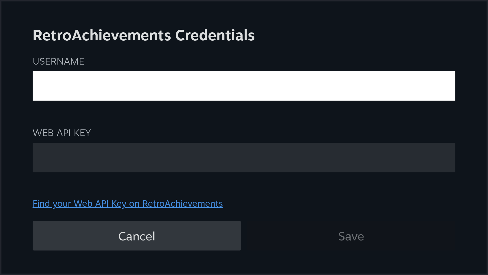</a>

    <a href="docs/images/getting-started-api-key.webp">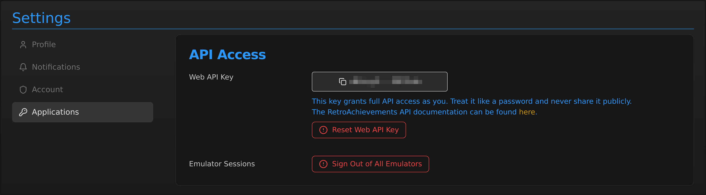</a>

3. Next, you will be asked to select a settings profile that works for you: between **Basic**, **Social**, and **Balanced**.

    <a href="docs/images/getting-started-profiles.webp">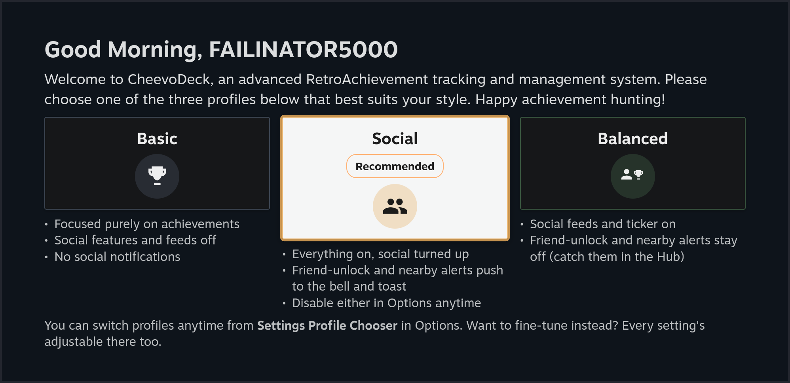</a>

    - **Basic** — This profile is for those who just want to hunt achievements, with none of the extra bells and whistles, so social features and notifications are turned off. This includes all of the core achievement hunting and tracking features, but without the extra noise.

    - **Social** — This is the recommended default for those starting CheevoDeck, as it includes all of the rich social features enabled with full notifications. You'll be notified via toasts of friend activity, such as unlocks, or whenever a player is near your progress. It is also pushed to the notification bell in the upper right corner of each page.

    - **Balanced** — A hybrid of the above features; it contains all of the social features, but they aren't pushed to notifications or toasts. They can instead be viewed in the feeds on-demand. This is good for people who want to focus on hunting achievements but don't want notifications and toasts informing them of social activity.

    The above three profiles can each be tweaked manually in the **Options** page, where you can fine-tune options such as the frequency of activity, which notifications & toasts you want on/off, and much more.

4. After selecting a settings profile, you will be asked to choose a view size preset.

    <a href="docs/images/getting-started-view-size.webp">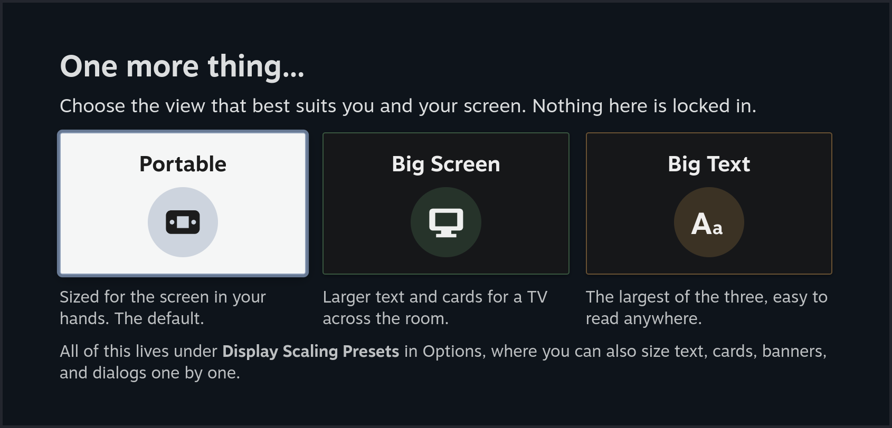</a>

    - **Portable** — This is the recommended default if you are on a portable device, such as Steam Deck or the Asus ROG Ally. Text and UI elements will seem about just-right.

    - **Big Screen** — Recommended for those who are playing on a TV, as it makes all text and UI elements larger for further viewing distances.

    - **Big Text** — This offers the biggest text and UI scale of the three.

    Nothing here is locked in — you can later further tweak the UI and accessibility settings in the **Options** page.

5. Finally, you will be asked to pick the **Main Menu** layout, choosing between the **Default View** and **Compact View**. This isn't locked in and can be changed anytime in **Options**.

    <a href="docs/images/getting-started-view-style.webp">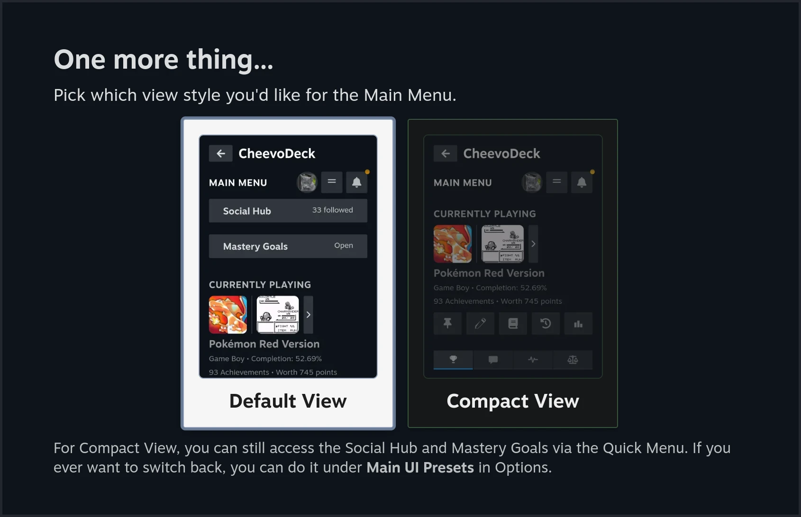</a>

6. Congratulations! You are now done with the onboarding and can now begin hunting achievements! Here's how it works:

    1. Start up your RetroAchievements supported game in whichever emulator you choose. Ensure you are logged into your RetroAchievements account within the emulator or front-end first. Once your game is started, RA is notified of the current game you are playing.

    2. Once the game is running, in **Game Mode**, press the **Quick Access Menu** button (**...** on Steam Deck) to open the side window. If CheevoDeck isn't opened, select it from your list of plugins. CheevoDeck will automatically detect that your game has changed by checking with RA. Your achievement progress and other stuff for that game will be loaded.

    3. Enjoy!

If nothing is loaded, make sure you are logged into your RA account in your emulator or front-end. Also, make sure your current game is supported on RetroAchievements and is a valid dump. If the game's hash differs from what RA has, it is not supported.

## Quick Start Tips

Most of CheevoDeck is reachable from the three buttons in the top right corner of the **Main Menu**. There are also various shortcuts that will allow you to get around quickly and smoothly, as well as toggle features on and off with ease. With the top button strip, combined with the shortcuts, getting around becomes a breeze.

### The Top Button Strip

<a href="docs/images/tutorial-top-button-strip.webp">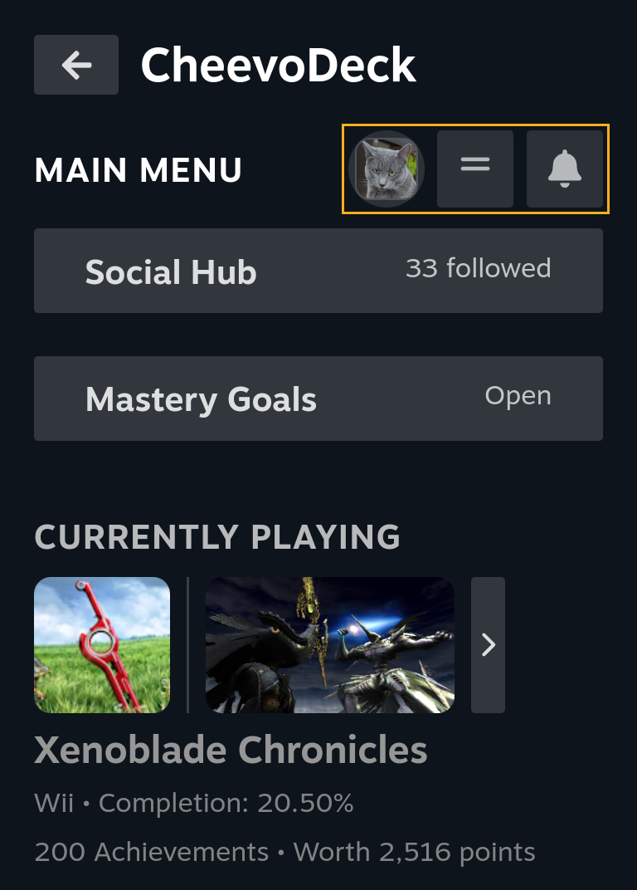</a>

On the **Main Menu** there are three buttons in the top right corner, and between these three you are able to access many pages and settings quickly. From left to right, there is the **Profile** button, **Quick Menu** button, and the **Notifications** button.

- **Profile** — This is the button with your RetroAchievements avatar on it. Selecting it brings you straight to your in-CheevoDeck profile page, where you can view all different kinds of stats about yourself, such as: points total, profile info, mastery goals, games list with status, recent games, current game with stats, ranking amongst friends, awards, want to play, wall posts, and much more.

- **Quick Menu** — The hamburger-looking one in the middle, and the single-most useful one, contains shortcuts to different pages and subsections, as well as shortcuts to instantly toggle different settings on or off; some of it can be customized as well.

- **Notifications** — The notification bell in the upper right corner can be used to access your **Notifications** feed. If you have any new notifications, you will see a glowing orange dot on top of the bell icon.

On every other page, the same corner gives you two buttons instead: **Home**, which takes you straight back to the **Main Menu** from wherever you are, and the same **Notifications** bell. No matter where you are, your **Notifications** feed is just one press away.

### The Quick Menu

<a href="docs/images/tutorial-quick-menu.webp">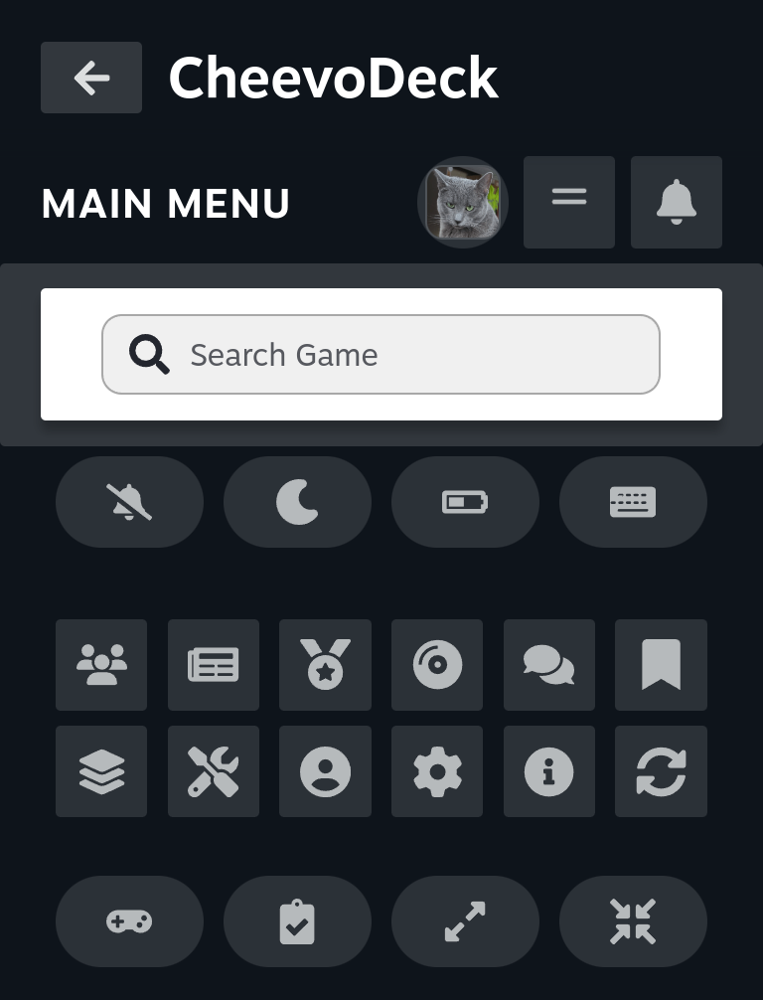</a>

Pressing the hamburger-looking button, as a part of the button strip, on the **Main Menu** opens the **Quick Menu** over the top of the page, and pressing **B** closes it again. Below is a breakdown of all of the features it offers, and you will learn just how powerful it really is:

- **Search Game** — The row at the very top. This allows you to look up any game that is supported on RetroAchievements, which then brings you to the **Game Info** page. Here you can view detailed game info, screenshots, videos, comments (view, post and subscribe), achievements, and patches (as well as download them too!).

- **The first row of buttons** — Useful toggles that you might find yourself commonly flipping.

    - **Do Not Disturb** — Turns off notifications and toasts while toggled on. This is also very useful to flip on if you plan to leave achievement hunting and play a Steam game; this stops you from getting unlock toasts while playing other games that are non-RetroAchievements related. There is one exception though: if you have a reminder set for one of your notes in the **Game Notes** page, you will still see the popup toast that reminds you about whatever you set. While you will no longer see the notification dot on the notifications bell in the upper right corner, you still get notifications pushed to it. It will just not bother you. Simply toggle off when done. What if you just want toasts off only but keep the orange dot on the notification bell? Luckily, you can achieve that (No pun intended). **Do Not Disturb** can be customized as to *what* it does when toggled on. Go to **Options** > **System** tab > **Do Not Disturb Disabled Features** and customize it there.

    - **Night Mode** — Simply dims all of your pages to make it easier on your eyes at night. You can customize the intensity in **Options** > **System** tab > **Night Mode**.

    - **Battery Saver** — Simply turns off most of your background services. So social services that fetch data and sends it to your feeds will be turned off. I'd like to note that I have done testing, and these services have such a minimal impact on battery. It's more useful if you just want to turn those services off temporarily, so you are not fetching from RA unnecessarily when not hunting achievements. And guess what? Just like with **Do Not Disturb**, you can customize *what* **Battery Saver** does when toggled on in **Options** > **System** tab > **Battery Saver Disabled Services**.

    - **Mouse & Keyboard Mode** — Useful if you are switching over to playing a standalone RetroAchievements-supported game such as Terraria or Final Fantasy XI. This switches over the UI to make everything work well for mouse and keyboard users. When going back to a controller-based game, simply turn it off and you are good to go.

- **The cluster of 12 small buttons** — These are quick shortcuts to different useful pages. From left to right, top to bottom: **Social Hub**, **News**, **Achievement of the Week**, **New Sets & Revisions**, **Subscribed Discussions**, **Saved Comments**, **Mastery Goals**, **Utilities**, **User Accounts**, **Options**, **About**, and a **Refresh**. While **News**, **Achievement of the Week**, **New Sets & Revisions**, **Subscribed Discussions**, and **Saved Comments** are all from the **Social Hub**, they are in different tabs and subsections within it, so these shortcuts in the **Quick Menu** make getting there incredibly fast.

- **The last row of buttons** — Your own custom shortcuts and actions. You can pin up to four of the places you go often or actions that you perform often, so they sit one press away. Which four is up to you, and you choose them in **Options** > **Display & Notifications** tab > **Customize Quick Menu**. Your default loadout is: **Dolphin Mapper**, **Social Activity Feed**, **UI: Default View**, and **UI: Compact View**.

The name of whatever you're hovering shows above the icons, so you can find your way around the grid without memorizing what each one means.

### Getting Around

Here are some speed-hacks that will help you move through the many pages of CheevoDeck like a pro:

- **B goes back, everywhere** — It's the fastest way through the plugin: press it once to leave a page for the one you came from, and keep pressing to end up back at the **Main Menu**. The one exception is if you press **B** on the **Main Menu**, it closes the plugin and brings you to the Decky plugin list. Or if you press **B** while in the **Quick Menu**, it closes it.

- **Use the Home button** — On every page but the **Main Menu**, there is a **Home** button in the upper right corner. Selecting this will immediately send you back to the **Main Menu**.

- **Jump to the top of any page** — **View** (Xbox, Steam Controller), **Minus** (Nintendo) and **Share/Create** (Sony) are all linked to **Page Up** by default, so pressing that button will instantly bring you to the top of whatever page you are on.

- **Open Notifications from anywhere** — **Menu** (Xbox, Steam Controller), **Plus** (Nintendo) and **Options** (Sony) are all linked to **Notifications** by default, so pressing that button will open your **Notifications** feed.

- **Make use of customizing the Quick Menu** — You can customize the bottom row of the **Quick Menu** on the **Main Menu**, adding custom shortcuts and actions to it. Do that by going to **Options** > **Display & Notifications** tab > **Customize Quick Menu**.

- **Map shortcuts and actions to your controller** — You can also skip the trip entirely by mapping common shortcuts and actions to your controller buttons. Go to **Options** > **System** tab > **Mapped Shortcuts** to customize this. While the other buttons are reserved for the core features in CheevoDeck, the ones that you are able to map are: **Menu**, **View**, **L3**, **L4**, **L5**, **R3**, **R4**, and **R5**.

    <a href="docs/images/tutorial-mapped-shortcuts.webp">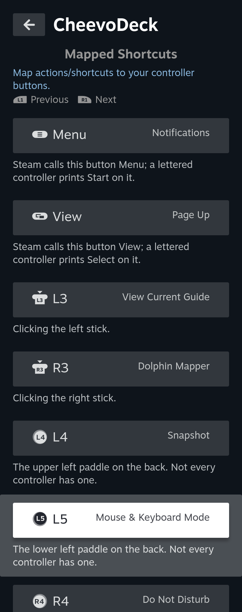</a>

For now, all mappings (minus snapshot) work within the **Quick Access Menu** environment which is 95% of CheevoDeck. Modal support will eventually be added for the ones that make sense.

### Customize Your Experience

If there ever is a moment, where you think to yourself, "Can I turn this off?" or "Can I change this?", consider checking the **Options** page, which contains over two-hundred settings for you to completely customize your experience. For example, on the **Main Menu**, by default you have the **Social Hub** and the **Mastery Goals** full-size buttons. It's not technically needed since it's in the **Quick Menu**, but it is convenient. Some people might wonder if they could remove those buttons. Well, there are options for that! Under **Options** > **Display & Notifications** tab > **Main UI Presets** you can choose the **Compact View** options to remove them. Want to remove just one of them? Or replace one with a different button? Or even add an additional full-size button? That can be done by going to **Options** > **Display & Notifications** tab > **Main Menu / Profile**. This is just a small taste of the customization you can do, so when in doubt, browse the **Options**!

<table>
  <tr>
    <td width="320" align="center"><a href="docs/images/tutorial-default-view.webp">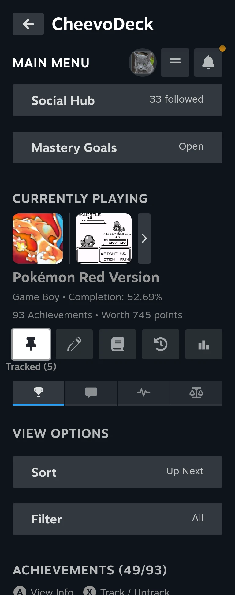</a></td>
    <td width="320" align="center"><a href="docs/images/tutorial-compact-view.webp">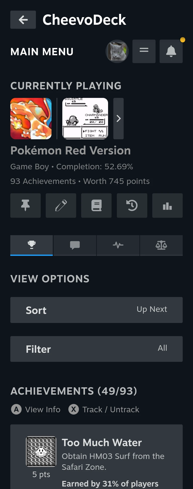</a></td>
  </tr>
  <tr>
    <td width="320" align="center"><b>Default View</b></td>
    <td width="320" align="center"><b>Compact View</b></td>
  </tr>
</table>

## Updating CheevoDeck

CheevoDeck makes updating an incredibly easy process. Whenever there is an update available, you will be notified of the update in your **Notifications** accessed via the bell on each page. To begin the update process, you can either select the update notification, which will bring you to the **About** page or you can access it directly from the **Main Menu** by selecting the **Quick Menu** > **About**.

1. In the About page, you have two options: You can either copy the URL link for the update or download the update directly to any location you like. In this case, it's recommended and much easier to just copy the URL link.

2. Once copied, exit the CheevoDeck plugin by selecting the back arrow (←) at the top of the page. You will now be within the **Decky Loader** plugins list.

3. While here, select the settings button in the upper right corner (the gear icon) and then ensure **Developer Mode** is enabled in the **General** settings tab. (It should be from when you installed CheevoDeck)

4. Select the **Developer** tab. If you chose to copy the URL from step 1, then select the field under **Install Plugin from URL**, paste your copied URL (Use the **Paste** button in the lower right corner of the on-screen keyboard), and then select **Install**. If you chose to download it instead, select the **Browse** button and choose your downloaded file.

5. The update for CheevoDeck will now be installed. All of your data stays intact and nothing is touched during the update process, so you can jump right back into achievement hunting with no issues.

I would also like to mention, while CheevoDeck does check for updates and notifies you automatically, it does it in 12-hour ticks. If you know an update is released and would like to download it right away, you can also select the **Check for Updates** button.

## Troubleshooting

### The **Main Menu** says "No Game Found"

This means that your RetroAchievements account is brand new and you have no last game registered with it yet. Simply play a supported game with that emulator signed in to your RetroAchievements account, and then go back into the CheevoDeck plugin. The data should then be loaded and populated.

### I keep getting an error saying that I have an invalid API Key all of a sudden

This can occur if you have changed your API key for RetroAchievements. To solve this, from the **Main Menu** go to **Quick Menu (The hamburger-looking menu at the top) > Options > Edit Credentials**. You can click the link in the dialog that pops up to be forwarded to the dashboard on RetroAchievements. Select the **Applications** tab and then select your API Key to copy to clipboard. From here, you can go back to the **Edit Credentials** dialog to paste your new API Key. Steam's on-screen keyboard contains the **Paste** option in the lower right corner. Ensure your username is up-to-date as well, and then simply save the new details.

### I changed my username at RetroAchievements. What do I do?

CheevoDeck is pretty resilient and will continue working, as most operations use users' ULID for data persistence and access under a given account. The backend service will eventually determine you have changed your username and will self-heal, so basically you don't have to worry about it!

### I'm getting random generic error messages, such as "Couldn't refresh your achievements right now", "Couldn't load this game's achievements.", "Couldn't load your recent unlocks right now.", and/or "Couldn't check your current game right now." What do these mean???

Depending on your location within the plugin, all of those are associated with a poor connection to RetroAchievements. It could be on your end as an intermittent drop in your internet connection or it could be on RetroAchievements's end as a server hiccup. Generally, once either of the problems resolve, you shouldn't see those errors anymore. If you want more advanced details, feel free to check the logs in **/home/deck/homebrew/logs/decky-cheevodeck**.

### My friend changed their avatar and I still see the old one

The friend avatar is cached for 48 hours, so it will be updated automatically via the backend roster service within that timeframe. If you would like to force the update immediately, an easy way to do this is to go to your friends list (or favorites) within **Social Hub** and press the Y button "Resolve" option (Triangle for PlayStation controller) while your friend is selected. This will queue immediate update which will usually take place within ten seconds.

### My friend changed their username and I still see the old name

Since almost all operations are done via the users' ULID, everything will continue to work, and the roster service will update the username within one week automatically. If you want to change it immediately, from the **Main Menu** go to **Quick Menu (The hamburger-looking menu at the top) > Options > Cache & Data Tab > Refresh Friends Now.**

### My friend avatar is wrong. Why? And how do I fix it?

RetroAchievements stores everyone's picture at an address built from their username. The catch is that when someone changes their name, their picture doesn't move with it — it stays where it was. So the plugin can end up looking in the wrong place.

Usually that just means no picture, and you get their initial instead. CheevoDeck's roster service automatically heals this for most situations; however, there are super rare instances where occasionally it's stranger and isn't repaired properly: if somebody else has since taken your friend's old username, the old address now points at that person's picture, and you'll see a face that isn't theirs. To fix this, go to your friends list (or favorites) within **Social Hub** and press the Y button "Resolve" option (Triangle for PlayStation controller) while your friend is selected. Rare instances like this are handled automatically by default if your friend is favorited. So technically you could just favorite that friend to resolve them too.

The plugin doesn't ask for everyone automatically from RA because it's one request per person and a big friends list would be a lot of requests. In other words, it's extremely expensive and can involve too many requests hitting up the RA API. It wouldn't be fair to RetroAchievements if the roster service does routine checks on a 100-friend list frequently, so in respect to them, we have made it conditional. So in other words, if you see your friend's avatar is off, which is extremely rare, simply fix it permanently by pressing the "Resolve" button while over them in the friends list.

## Localization

CheevoDeck ships in eight languages: English, German, Spanish, French, Japanese, Polish, Portuguese and Russian. I only speak English and know a little bit of German and Japanese. For the most part, the other seven were translated without a native speaker, so while they should be perfectly understandable, some of it is bound to read stiffly or miss the phrase a player would actually use. If one of these is your language and something reads wrong to you, a fix is genuinely welcome — and so is a language that isn't here yet.

## Motivation

What really motivated me to work on CheevoDeck is my nephew's interest in RetroAchievements. This plugin was really developed for him, but that doesn't mean I shouldn't share it! Over the past year, my friends and family have probably spent thousands of hours using (and indirectly testing) CheevoDeck, enjoying RetroAchievements. It wasn't until recently that I officially decided I should probably share the love with the community as well. So here it is, and I sincerely hope you all enjoy this. If this brings joy to even one person, I'm happy with that. This plugin was developed from the ground-up with social features implemented, because it helps bring me and my family even closer—even though we are hundreds of miles apart.

## Challenges & Limitations

### Almost everything lives in the Quick Access Menu

This was the whole point of CheevoDeck, but it's also the hardest thing to build against. The QAM side panel is a narrow column and it has no concept of pages or navigation the way a normal app does. There's no such thing as "going to another screen" in here. Every screen in the plugin actually exists at the same time, in the same place, and only one of them draws itself at a time. It's an unusual way to build something, but it certainly creates a favorable outcome.

### The panel gets unmounted/thrown away every time you close it

The front-end gets completely unmounted/destroyed as the **Quick Access Menu** closes. So the plugin has no memory of its own. Whatever page you were on, whatever guide you had open, where you'd scrolled to, which tab you were reading, all of it is gone the instant you close the panel unless it was written down somewhere first.

The part that took some getting used to is the state had to be persisted for each page. So, for example, when I re-open the **Profile** page, I expect my previous game I was looking at for a friend to be there still, along with the current sorting and filtering methods. What complicated things is where I had to use modal dialogs. Modal dialogs force the QAM to close, which in turn causes it to unmount; so I had to factor in handling persistence there as well.

I avoided using modal dialogs in general. First, because I want this plugin to be greater than 95% within the QAM, making it portable. Second, because I would have to factor in persistence and resume state. This is why in the **Options** page, I have added controls that cycle options at the press of a button versus having it open up a modal and tear everything down. And, in the end, it did turn out to be quite the surprise and has worked pretty well.

Overall, with that in-mind, in the future perhaps I will further improve features like remembering where you left off when viewing an achievement. I've already implemented that for comments and that largely has been a success; however, it gets a little complicated because content is loaded dynamically. So once I further fine-tune comments, and I feel confident enough, I will attempt persist and resume state regarding other things within the plugin, such as achievement cards. I notice other Decky Loader plugins tend to not remember the state of dynamic content either, and I honestly don't blame them. On a positive note, I have established working methods, so I can perhaps apply it to other things in the future!

### The focus ring sometimes doesn't show up when you open the QAM

This one isn't CheevoDeck's fault, and you can prove it to yourself in about ten seconds. Launch a game, then spam the QAM button open and closed on a built-in section like **Performance Settings**. Same game, same panel, nothing to do with any plugin, and some of the time you will notice the component you had selected does not paint the selection ring at all. Other times it's fine. That's the whole problem in a nutshell: it's a coin flip. What's actually going on is that Steam only switches its gamepad focus system on if the panel has the keyboard focus at the exact instant it opens, and it only ever checks that once. With a game running, the game is holding onto focus, so whether the panel gets there in time before that single check happens is down to timing. When it misses, nothing on the panel gets a highlight, including Steam's own buttons. Your d-pad still moves the cursor around perfectly fine either way, you just can't see where it is. CheevoDeck nudges the panel when it opens so that Steam runs its check again and paints the ring like it should. Figuring that out took a while, because when something only breaks half the time it's very easy to blame the wrong thing. It took many nights of debugging and reading logs to determine what was going on, but I'm glad I now know or think I know what the situation was.

### Everything is paced around RetroAchievements' servers

RetroAchievements is a free, community-run site and their API will rate-limit you if you hammer it, which is completely fair. That means CheevoDeck can't just grab everything the moment you open it. Achievement icons, avatars, friend activity and progress all fill in progressively rather than instantly, and a few features are deliberately conditional instead of automatic (checking every single friend avatar on a 100-friend list would be 100 requests, and that's just not a polite thing to do to somebody else's servers). If something looks like it's loading slowly, that's usually this being deliberate rather than something being broken. You can raise the limits yourself in **Options** if you're on a fast connection, but the defaults are set to be a good guest in respect to the RA servers.

### SteamOS updates / Steam Client updates can and will break things

Steam updates its interface and client regularly, and it isn't built with plugins in mind, so things that worked perfectly fine one month can quietly stop working the next. Negative CSS margins used to work and don't anymore is one example. I know, it's probably not recommended practice, but at one-point (as this started as a personal project) I hardcoded negative margins for a feature and the spacing broke with an update. Fixed and avoided since that situation. Steam owns the scroll position and will sometimes throw away yours. None of this is anybody's fault, it's just the reality of building on top of a moving target, and it's why some parts of the plugin are written in a way that looks a bit odd until you know what broke.

## Building

### What you'll need

Node with **pnpm** (the repo is pinned to pnpm 9.15.9), and Python 3.11 to match the runtime Decky bundles. You'll also want **Decky Loader** installed on whatever device you're testing on, since that's what actually loads the plugin. You don't need Python locally to build, only if you want to run the backend checks.

One extra thing if you're touching the Python side: **ruff** is the linter I use for the backend and it isn't an npm package, so **pnpm install** won't bring it along. Install it with **pipx install ruff**, or skip installing anything and run it through **uvx**. Ignore this entirely if you're only working on the frontend.

### Getting set up

Clone the repo and run **pnpm install**. That's the only setup step for the frontend, and it brings the build along with the TypeScript and knip checks below.

### Building it

**pnpm run build**. Rollup bundles the whole frontend down into **dist/index.js**, which is the file that actually ships. There's also **pnpm run watch** if you'd rather have it rebuild as you save.

### Checking your work

**npx tsc --noEmit** is the one that matters most. TypeScript is set to strict here, plus noUnusedLocals and noUnusedParameters, so it's fussier than a default setup and it catches a lot before anything ever reaches a device.

**npx knip** looks for exports, files and dependencies that nothing uses. It's currently at zero findings and I'd like to keep it there, so if it starts reporting something after your change, that's worth a look rather than a shrug.

**ruff check main.py py_modules/** handles the Python side. The config lives in the repo as **ruff.toml**, so however you installed ruff you'll get the same rules I do. There should be exactly 6 findings, and all 6 are deliberate: I've looked at each one and decided to leave it. If you see 7, the new one is yours.

Please don't run **ruff format**. It would reformat the entire backend away from how the rest of it is written. The workspace settings in **.vscode/settings.json** already turn format-on-save off for Python so the Ruff extension can't do it to you by accident, which is the reason that file is tracked at all.

### Testing

The only real way to know if something is working is to put it on a SteamOS device and use it. The checks above will catch a lot, but they cannot tell you that a feature behaves the way it should.

### Getting it onto a device

There are two deploy scripts in **.vscode/scripts/**. **deploy-local.sh** copies the plugin into **/home/deck/homebrew/plugins/decky-cheevodeck** and restarts Decky, which is what you want if you're building on the Deck itself. **deploy.sh** does the same thing over SSH if you're working on another machine and pushing to a Deck on your network.

The SSH one has to be told where your Deck is. Copy **.vscode/deploy-settings.example.json** to **.vscode/deploy-settings.json** and fill in your host, your username, and a key path if you use one instead of a password. That file is gitignored, so your home network never ends up in a commit, and **deploy.sh** reads it itself, which means it works the same from a plain terminal as it does from the **Deploy** task in VS Code. It's read with python3 when it's there, and if you skip it entirely the script tells you rather than hanging on a connection to nowhere.

What actually gets copied: **dist/**, **main.py**, **py_modules/** and **defaults/**. The **src/** folder is deliberately excluded, because the bundle is what runs, not the TypeScript. So if you changed frontend code and nothing seems different on the device, the usual reason is that the build didn't run.

### Making a release zip

**.vscode/scripts/package.sh** builds the same zip that goes up on the Releases page, which also makes it the way to test a real install instead of an rsync deploy. It runs **pnpm run build** first, so **dist/** always matches the source being packaged, then writes **out/CheevoDeck-<version>.zip** with the version read straight out of **package.json**. **out/** is gitignored. While the packaging script is in the **.vscode** folder, it will run from anywhere, such as a terminal.

It refuses to run on a dirty working tree, because a zip built from uncommitted changes isn't a build of anything you can point back at later. **PACKAGE_ALLOW_DIRTY=1** overrides that if you know that's what you want, and **PACKAGE_SKIP_BUILD=1** reuses **dist/** as it stands instead of rebuilding.

I'd like to mention this before you add files to the project: it packages an allowlist, not everything minus a denylist. Ten paths go in — **main.py**, **plugin.json**, **package.json**, **LICENSE**, **THIRD-PARTY-LICENSES**, **README.md**, **ATTRIBUTIONS.md**, **dist/**, **py_modules/** and **defaults/**. Anything else is left out. So a new file the plugin needs at runtime has to be added to that list as well, or it'll work fine on your own device, where the deploy scripts put it there, and be missing from a fresh install. If a listed path is missing the script stops rather than shipping a zip with a hole in it.

If you're thinking about contributing, have a read of [CONTRIBUTING.md](CONTRIBUTING.md) first. It covers what to raise with me before you start on anything, and what to run before you open a pull request.

## Architecture

How the plugin is put together is written up in [docs/architecture.md](docs/architecture.md).

## Credits

The people and projects that made parts of CheevoDeck easier, faster, or possible at all are thanked in [ATTRIBUTIONS.md](ATTRIBUTIONS.md).

## Author & Support

CheevoDeck is written by Jameson (FAILINATOR5000).

Have any cool ideas you'd like to see implemented? Or just have questions, need help, or have bug reports? You can contact me via email at [FAILINATOR5000@proton.me](mailto:FAILINATOR5000@proton.me).

## License

BSD 3-Clause. The full text is in [LICENSE](LICENSE), and the licenses for third-party components are in [THIRD-PARTY-LICENSES](THIRD-PARTY-LICENSES).

## Disclaimer

CheevoDeck is not affiliated with or endorsed by Steam, Valve, RetroAchievements, GameFAQs, or Decky Loader. It does not provide downloads to ROMs, BIOS, or game data.
